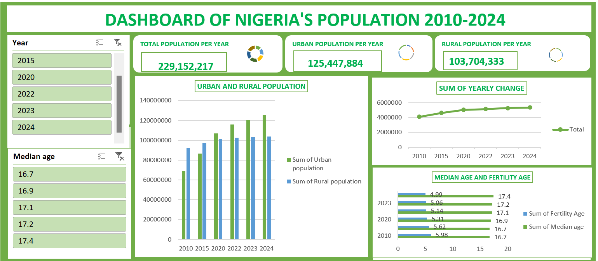

# Excel-Practice
---

## Project one : Nigeria's Population Dashboard
---
### Table of Contents
- [Data Overview](Data-overview)
- [Data Source](Data-source)
- [Recommendation](Recommendation)

### Data Overview

This data analysis project aims to visualize the population dynamics of Nigeria from 2010 to 2024. Through this visualization, we seek to gain insights into the trends and patterns of Nigeria's population growth and how various factors have influenced these dynamics over the years. The analysis provides a comprehensive view of the population changes and highlights key influences on the demographic shifts observed during this period.

### Data Source

The data for this analysis was obtained from the "Nigeria Population Data Store." The dataset provided was already cleaned and prepared for analysis, ensuring accuracy and reliability in the visualization and insights derived.

### Explanatory Data Analysis

The Explanatory Data Analysis (EDA) for Nigeria's population data from 2010 to 2024 involves several key steps to understand and visualize the underlying trends and patterns. The main objectives of the EDA are to:

#### Examine the Population Growth Trend:

- Visualize the year-on-year population growth.
- Identify any significant changes or anomalies in the population figures.
- Analyze age distribution and gender ratio over the years.
- Explore urban versus rural population trends.

#### Investigate Influencing Factors:

- Correlate population changes with economic indicators, healthcare advancements, and policy changes.
- Assess the impact of migration, birth, and death rates on the population dynamics.

#### Highlight Regional Variations:

- Compare population growth across different regions or states within Nigeria.
- Identify regions with the highest and lowest growth rates.

### Methods and Tools Used:

Data Visualization: Line charts, bar graphs, and heat maps to represent population trends and regional variations.
Statistical Analysis: Descriptive statistics to summarize the central tendency, dispersion, and shape of the dataset’s distribution.
Correlation Analysis: Examining the relationship between population growth and other socio-economic factors.

### Key Findings:

The population of Nigeria has shown a consistent upward trend from 2010 to 2024.
Significant growth spurts were observed in specific years, possibly due to policy changes or economic factors.
Urban areas have experienced more rapid population growth compared to rural areas.
Certain regions exhibit distinct population trends that may be influenced by local factors.
